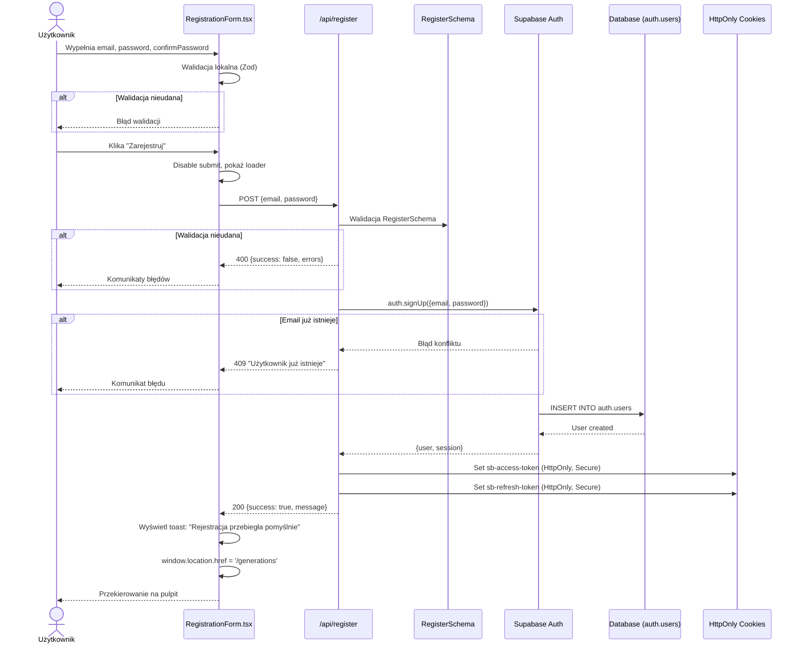
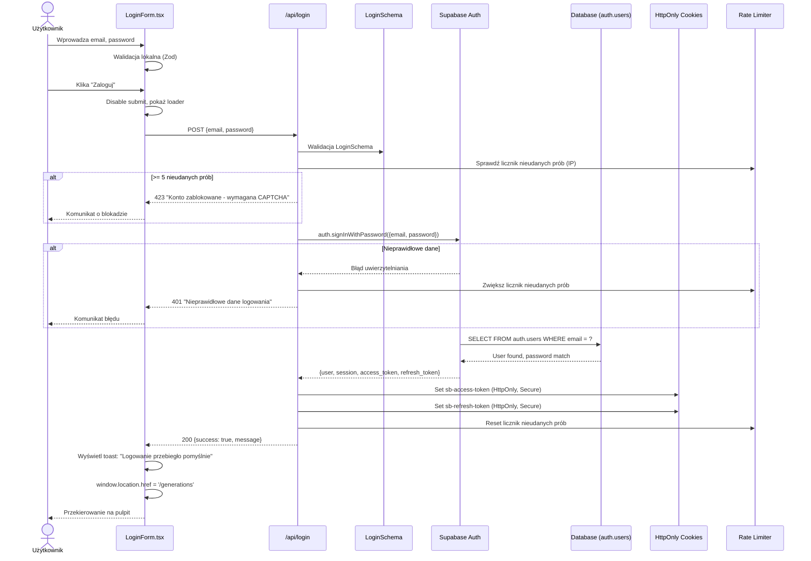
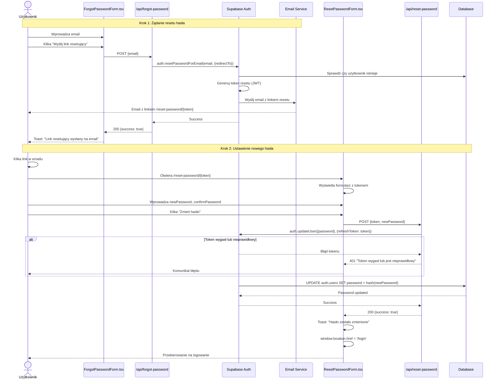
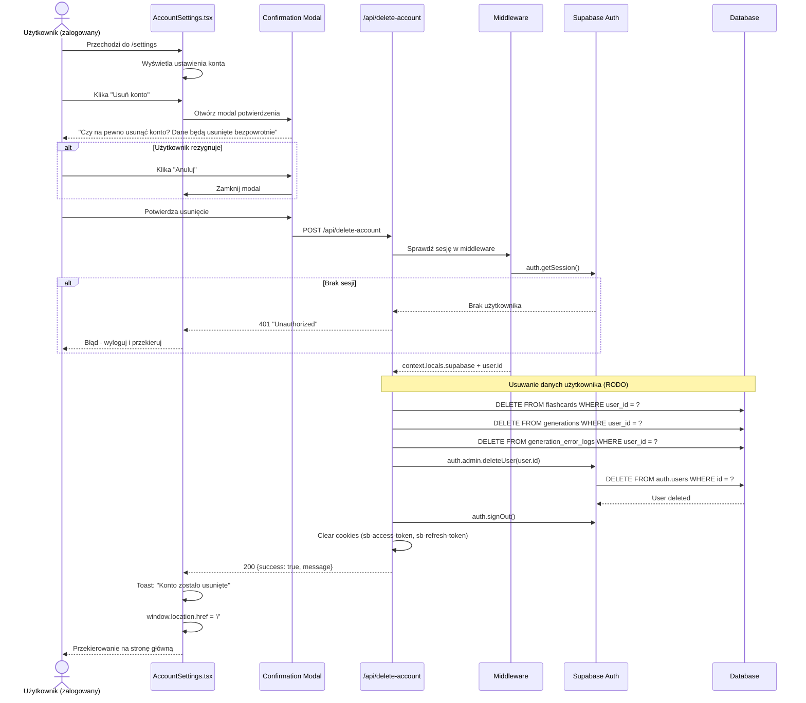
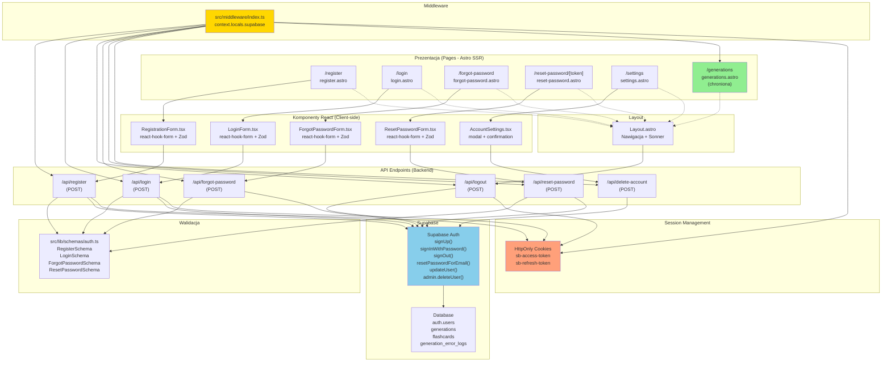
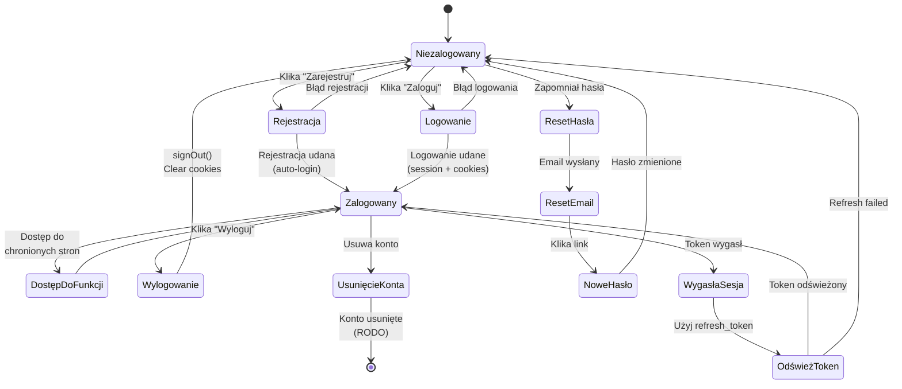
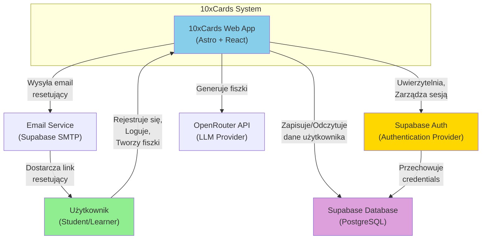
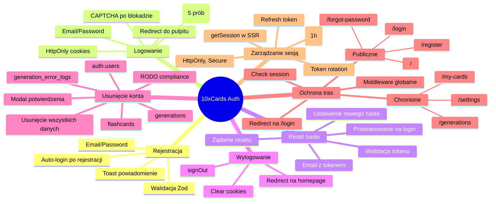
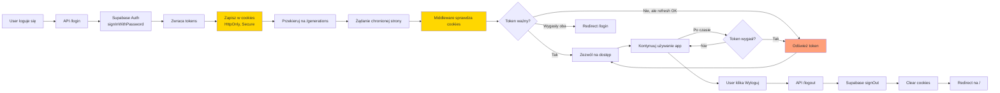

# Diagramy architektury uwierzytelniania - 10xCards

## 1. Diagram sekwencji - Rejestracja użytkownika (US-007)



## 2. Diagram sekwencji - Logowanie użytkownika (US-008)



## 3. Diagram sekwencji - Reset hasła (US-011 - odzyskiwanie hasła)



## 4. Diagram sekwencji - Usunięcie konta (US-009)



## 5. Diagram komponentów - Architektura modułu autentykacji



## 6. Diagram przepływu - Ochrona tras (Middleware)

```mermaid
flowchart TD
    Start([Żądanie użytkownika]) --> MW{Middleware<br/>onRequest}
    MW --> GetSession[context.locals.supabase<br/>auth.getSession]
    
    GetSession --> CheckPath{Sprawdź<br/>ścieżkę}
    
    CheckPath -->|Publiczna<br/>/, /login, /register| AllowPublic[Zezwól na dostęp]
    AllowPublic --> Next[return next]
    
    CheckPath -->|Chroniona<br/>/generations, /settings| CheckAuth{Czy jest<br/>sesja?}
    
    CheckAuth -->|Tak<br/>session.user| AllowProtected[Zezwól na dostęp]
    AllowProtected --> Next
    
    CheckAuth -->|Nie<br/>!session| Redirect[redirect('/login')]
    Redirect --> End([Przekierowanie])
    
    Next --> End2([Kontynuuj żądanie])
    
    style Start fill:#90EE90
    style MW fill:#FFD700
    style CheckAuth fill:#87CEEB
    style Redirect fill:#FF6B6B
    style Next fill:#90EE90
```

## 7. Diagram stanów - Sesja użytkownika



## 8. Diagram C4 - Kontekst systemu



## 9. Mapa funkcjonalności autentykacji



## 10. Przepływ danych - Cykl życia sesji



---

## Legenda kolorów:

- 🟢 **Zielony** - Punkty wejścia użytkownika, komponenty publiczne
- 🔵 **Niebieski** - Komponenty aplikacji, strony
- 🟡 **Żółty** - Middleware, sesje, krytyczne punkty kontroli
- 🟣 **Fioletowy** - Baza danych
- 🟠 **Pomarańczowy** - Zarządzanie tokenami/ciasteczkami
- 🔴 **Czerwony** - Błędy, przekierowania, blokady

## Uwagi techniczne:

1. **Walidacja dwustronna**: Wszystkie formularze używają tych samych schematów Zod po stronie klienta i serwera
2. **Security**: Tokeny przechowywane tylko w HttpOnly, Secure cookies
3. **Rate limiting**: Po 5 nieudanych próbach logowania wymagana CAPTCHA
4. **RODO**: Usunięcie konta usuwa wszystkie powiązane dane użytkownika
5. **Token rotation**: Refresh token rotacja włączona (10s reuse interval)
6. **Session lifetime**: Access token ważny 1h, refresh token według konfiguracji Supabase
7. **Middleware globalne**: Sprawdza sesję dla wszystkich żądań, przekierowuje niezalogowanych z tras chronionych

