# Diagramy architektury uwierzytelniania - 10xCards

## 1. Diagram sekwencji - Rejestracja użytkownika (US-007)

```mermaid
sequenceDiagram
    actor User as Użytkownik
    participant RF as RegistrationForm.tsx
    participant API as /api/register
    participant Zod as RegisterSchema
    participant SB as Supabase Auth
    participant DB as Database (auth.users)
    participant Cookie as HttpOnly Cookies
    
    User->>RF: Wypełnia email, password, confirmPassword
    RF->>RF: Walidacja lokalna (Zod)
    alt Walidacja nieudana
        RF-->>User: Błąd walidacji
    end
    
    User->>RF: Klika "Zarejestruj"
    RF->>RF: Disable submit, pokaż loader
    RF->>API: POST {email, password}
    
    API->>Zod: Walidacja RegisterSchema
    alt Walidacja nieudana
        API-->>RF: 400 {success: false, errors}
        RF-->>User: Komunikaty błędów
    end
    
    API->>SB: auth.signUp({email, password})
    alt Email już istnieje
        SB-->>API: Błąd konfliktu
        API-->>RF: 409 "Użytkownik już istnieje"
        RF-->>User: Komunikat błędu
    end
    
    SB->>DB: INSERT INTO auth.users
    DB-->>SB: User created
    SB-->>API: {user, session}
    
    API->>Cookie: Set sb-access-token (HttpOnly, Secure)
    API->>Cookie: Set sb-refresh-token (HttpOnly, Secure)
    API-->>RF: 200 {success: true, message}
    
    RF->>RF: Wyświetl toast: "Rejestracja przebiegła pomyślnie"
    RF->>RF: window.location.href = '/generations'
    RF-->>User: Przekierowanie na pulpit
```



## 2. Diagram sekwencji - Logowanie użytkownika (US-008)

```mermaid
sequenceDiagram
    actor User as Użytkownik
    participant LF as LoginForm.tsx
    participant API as /api/login
    participant Zod as LoginSchema
    participant SB as Supabase Auth
    participant DB as Database (auth.users)
    participant Cookie as HttpOnly Cookies
    participant RC as Rate Limiter
    
    User->>LF: Wprowadza email, password
    LF->>LF: Walidacja lokalna (Zod)
    
    User->>LF: Klika "Zaloguj"
    LF->>LF: Disable submit, pokaż loader
    LF->>API: POST {email, password}
    
    API->>Zod: Walidacja LoginSchema
    API->>RC: Sprawdź licznik nieudanych prób (IP)
    alt >= 5 nieudanych prób
        API-->>LF: 423 "Konto zablokowane - wymagana CAPTCHA"
        LF-->>User: Komunikat o blokadzie
    end
    
    API->>SB: auth.signInWithPassword({email, password})
    alt Nieprawidłowe dane
        SB-->>API: Błąd uwierzytelniania
        API->>RC: Zwiększ licznik nieudanych prób
        API-->>LF: 401 "Nieprawidłowe dane logowania"
        LF-->>User: Komunikat błędu
    end
    
    SB->>DB: SELECT FROM auth.users WHERE email = ?
    DB-->>SB: User found, password match
    SB-->>API: {user, session, access_token, refresh_token}
    
    API->>Cookie: Set sb-access-token (HttpOnly, Secure)
    API->>Cookie: Set sb-refresh-token (HttpOnly, Secure)
    API->>RC: Reset licznik nieudanych prób
    API-->>LF: 200 {success: true, message}
    
    LF->>LF: Wyświetl toast: "Logowanie przebiegło pomyślnie"
    LF->>LF: window.location.href = '/generations'
    LF-->>User: Przekierowanie na pulpit
```



## 3. Diagram sekwencji - Reset hasła (US-011 - odzyskiwanie hasła)

```mermaid
sequenceDiagram
    actor User as Użytkownik
    participant FPF as ForgotPasswordForm.tsx
    participant API1 as /api/forgot-password
    participant SB as Supabase Auth
    participant Email as Email Service
    participant RPF as ResetPasswordForm.tsx
    participant API2 as /api/reset-password
    participant DB as Database
    
    Note over User,Email: Krok 1: Żądanie resetu hasła
    User->>FPF: Wprowadza email
    User->>FPF: Klika "Wyślij link resetujący"
    FPF->>API1: POST {email}
    
    API1->>SB: auth.resetPasswordForEmail(email, {redirectTo})
    SB->>DB: Sprawdź czy użytkownik istnieje
    SB->>SB: Generuj token resetu (JWT)
    SB->>Email: Wyślij email z linkiem resetu
    Email-->>User: Email z linkiem /reset-password/[token]
    SB-->>API1: Success
    API1-->>FPF: 200 {success: true}
    FPF-->>User: Toast: "Link resetujący wysłany na email"
    
    Note over User,DB: Krok 2: Ustawienie nowego hasła
    User->>User: Klika link w emailu
    User->>RPF: Otwiera /reset-password/[token]
    RPF->>RPF: Wyświetla formularz z tokenem
    
    User->>RPF: Wprowadza newPassword, confirmPassword
    User->>RPF: Klika "Zmień hasło"
    RPF->>API2: POST {token, newPassword}
    
    API2->>SB: auth.updateUser({password}, {refreshToken: token})
    alt Token wygasł lub nieprawidłowy
        SB-->>API2: Błąd tokenu
        API2-->>RPF: 401 "Token wygasł lub jest nieprawidłowy"
        RPF-->>User: Komunikat błędu
    end
    
    SB->>DB: UPDATE auth.users SET password = hash(newPassword)
    DB-->>SB: Password updated
    SB-->>API2: Success
    API2-->>RPF: 200 {success: true}
    
    RPF->>RPF: Toast: "Hasło zostało zmienione"
    RPF->>RPF: window.location.href = '/login'
    RPF-->>User: Przekierowanie na logowanie
```



## 4. Diagram sekwencji - Usunięcie konta (US-009)

```mermaid
sequenceDiagram
    actor User as Użytkownik (zalogowany)
    participant AS as AccountSettings.tsx
    participant Modal as Confirmation Modal
    participant API as /api/delete-account
    participant MW as Middleware
    participant SB as Supabase Auth
    participant DB as Database
    
    User->>AS: Przechodzi do /settings
    AS->>AS: Wyświetla ustawienia konta
    
    User->>AS: Klika "Usuń konto"
    AS->>Modal: Otwórz modal potwierdzenia
    Modal-->>User: "Czy na pewno usunąć konto? Dane będą usunięte bezpowrotnie"
    
    alt Użytkownik rezygnuje
        User->>Modal: Klika "Anuluj"
        Modal->>AS: Zamknij modal
    end
    
    User->>Modal: Potwierdza usunięcie
    Modal->>API: POST /api/delete-account
    
    API->>MW: Sprawdź sesję w middleware
    MW->>SB: auth.getSession()
    alt Brak sesji
        SB-->>API: Brak użytkownika
        API-->>AS: 401 "Unauthorized"
        AS-->>User: Błąd - wyloguj i przekieruj
    end
    
    MW-->>API: context.locals.supabase + user.id
    
    Note over API,DB: Usuwanie danych użytkownika (RODO)
    API->>DB: DELETE FROM flashcards WHERE user_id = ?
    API->>DB: DELETE FROM generations WHERE user_id = ?
    API->>DB: DELETE FROM generation_error_logs WHERE user_id = ?
    
    API->>SB: auth.admin.deleteUser(user.id)
    SB->>DB: DELETE FROM auth.users WHERE id = ?
    DB-->>SB: User deleted
    
    API->>SB: auth.signOut()
    API->>API: Clear cookies (sb-access-token, sb-refresh-token)
    API-->>AS: 200 {success: true, message}
    
    AS->>AS: Toast: "Konto zostało usunięte"
    AS->>AS: window.location.href = '/'
    AS-->>User: Przekierowanie na stronę główną
```



## 5. Diagram komponentów - Architektura modułu autentykacji


## 6. Diagram przepływu - Ochrona tras (Middleware)

```mermaid
flowchart TD
    Start([Żądanie użytkownika]) --> MW{Middleware<br/>onRequest}
    MW --> GetSession[context.locals.supabase<br/>auth.getSession]
    
    GetSession --> CheckPath{Sprawdź<br/>ścieżkę}
    
    CheckPath -->|Publiczna<br/>/, /login, /register| AllowPublic[Zezwól na dostęp]
    AllowPublic --> Next[return next]
    
    CheckPath -->|Chroniona<br/>/generations, /settings| CheckAuth{Czy jest<br/>sesja?}
    
    CheckAuth -->|Tak<br/>session.user| AllowProtected[Zezwól na dostęp]
    AllowProtected --> Next
    
    CheckAuth -->|Nie<br/>!session| Redirect[redirect('/login')]
    Redirect --> End([Przekierowanie])
    
    Next --> End2([Kontynuuj żądanie])
    
    style Start fill:#90EE90
    style MW fill:#FFD700
    style CheckAuth fill:#87CEEB
    style Redirect fill:#FF6B6B
    style Next fill:#90EE90
```

## 7. Diagram stanów - Sesja użytkownika

```mermaid
stateDiagram-v2
    [*] --> Niezalogowany
    
    Niezalogowany --> Rejestracja: Klika "Zarejestruj"
    Rejestracja --> Zalogowany: Rejestracja udana<br/>(auto-login)
    Rejestracja --> Niezalogowany: Błąd rejestracji
    
    Niezalogowany --> Logowanie: Klika "Zaloguj"
    Logowanie --> Zalogowany: Logowanie udane<br/>(session + cookies)
    Logowanie --> Niezalogowany: Błąd logowania
    
    Zalogowany --> DostępDoFunkcji: Dostęp do<br/>chronionych stron
    DostępDoFunkcji --> Zalogowany
    
    Zalogowany --> Wylogowanie: Klika "Wyloguj"
    Wylogowanie --> Niezalogowany: signOut()<br/>Clear cookies
    
    Zalogowany --> UsunięcieKonta: Usuwa konto
    UsunięcieKonta --> [*]: Konto usunięte<br/>(RODO)
    
    Niezalogowany --> ResetHasła: Zapomniał hasła
    ResetHasła --> ResetEmail: Email wysłany
    ResetEmail --> NoweHasło: Klika link
    NoweHasło --> Niezalogowany: Hasło zmienione
    
    Zalogowany --> WygasłaSesja: Token wygasł
    WygasłaSesja --> OdświeżToken: Użyj refresh_token
    OdświeżToken --> Zalogowany: Token odświeżony
    OdświeżToken --> Niezalogowany: Refresh failed
```



## 8. Diagram C4 - Kontekst systemu

```mermaid
graph TB
    subgraph "10xCards System"
        WebApp["10xCards Web App<br/>(Astro + React)"]
    end
    
    User["Użytkownik<br/>(Student/Learner)"]
    Email["Email Service<br/>(Supabase SMTP)"]
    SupabaseAuth["Supabase Auth<br/>(Authentication Provider)"]
    SupabaseDB["Supabase Database<br/>(PostgreSQL)"]
    OpenRouter["OpenRouter API<br/>(LLM Provider)"]
    
    User -->|Rejestruje się,<br/>Loguje,<br/>Tworzy fiszki| WebApp
    WebApp -->|Wysyła email<br/>resetujący| Email
    Email -->|Dostarcza link<br/>resetujący| User
    WebApp -->|Uwierzytelnia,<br/>Zarządza sesją| SupabaseAuth
    WebApp -->|Zapisuje/Odczytuje<br/>dane użytkownika| SupabaseDB
    WebApp -->|Generuje fiszki| OpenRouter
    
    SupabaseAuth -->|Przechowuje<br/>credentials| SupabaseDB
    
    style User fill:#90EE90
    style WebApp fill:#87CEEB
    style SupabaseAuth fill:#FFD700
    style SupabaseDB fill:#DDA0DD
```



## 9. Mapa funkcjonalności autentykacji

```mermaid
mindmap
  root((10xCards Auth))
    Rejestracja
      Email/Password
      Walidacja Zod
      Auto-login po rejestracji
      Toast powiadomienie
    Logowanie
      Email/Password
      Rate limiting (5 prób)
      CAPTCHA po blokadzie
      HttpOnly cookies
      Redirect do pulpitu
    Reset hasła
      Żądanie resetu
      Email z tokenem
      Ustawienie nowego hasła
      Walidacja tokenu
      Przekierowanie na login
    Wylogowanie
      signOut
      Clear cookies
      Redirect na homepage
    Usunięcie konta
      Modal potwierdzenia
      Usunięcie wszystkich danych
      RODO compliance
      auth.users
      generations
      flashcards
      generation_error_logs
    Ochrona tras
      Middleware globalne
      Check session
      Redirect na /login
      Chronione
        /generations
        /settings
        /my-cards
      Publiczne
        /
        /login
        /register
        /forgot-password
    Zarządzanie sesją
      Access token (1h)
      Refresh token
      Token rotation
      HttpOnly, Secure
      getSession w SSR
```



## 10. Przepływ danych - Cykl życia sesji

```mermaid
graph LR
    A[User loguje się] --> B[API /login]
    B --> C[Supabase Auth<br/>signInWithPassword]
    C --> D[Zwraca tokens]
    D --> E[Zapisz w cookies<br/>HttpOnly, Secure]
    E --> F[Przekieruj na /generations]
    
    F --> G[Żądanie chronionej strony]
    G --> H[Middleware sprawdza cookies]
    H --> I{Token ważny?}
    
    I -->|Tak| J[Zezwól na dostęp]
    I -->|Nie, ale refresh OK| K[Odśwież token]
    K --> J
    
    I -->|Wygasły oba| L[Redirect /login]
    
    J --> M[Kontynuuj używanie app]
    M -->|Po czasie| N{Token wygasł?}
    N -->|Tak| K
    N -->|Nie| M
    
    M --> O[User klika Wyloguj]
    O --> P[API /logout]
    P --> Q[Supabase signOut]
    Q --> R[Clear cookies]
    R --> S[Redirect na /]
    
    style E fill:#FFD700
    style H fill:#FFD700
    style K fill:#FFA07A
```



---

## Legenda kolorów:

- 🟢 **Zielony** - Punkty wejścia użytkownika, komponenty publiczne
- 🔵 **Niebieski** - Komponenty aplikacji, strony
- 🟡 **Żółty** - Middleware, sesje, krytyczne punkty kontroli
- 🟣 **Fioletowy** - Baza danych
- 🟠 **Pomarańczowy** - Zarządzanie tokenami/ciasteczkami
- 🔴 **Czerwony** - Błędy, przekierowania, blokady

## Uwagi techniczne:

1. **Walidacja dwustronna**: Wszystkie formularze używają tych samych schematów Zod po stronie klienta i serwera
2. **Security**: Tokeny przechowywane tylko w HttpOnly, Secure cookies
3. **Rate limiting**: Po 5 nieudanych próbach logowania wymagana CAPTCHA
4. **RODO**: Usunięcie konta usuwa wszystkie powiązane dane użytkownika
5. **Token rotation**: Refresh token rotacja włączona (10s reuse interval)
6. **Session lifetime**: Access token ważny 1h, refresh token według konfiguracji Supabase
7. **Middleware globalne**: Sprawdza sesję dla wszystkich żądań, przekierowuje niezalogowanych z tras chronionych

